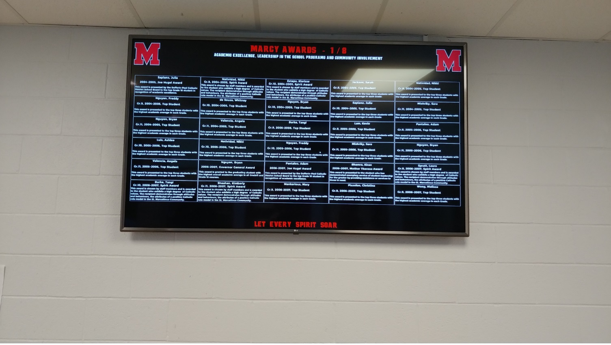

- A modular, object-oriented client-side Java application for my local high school that displays information about students who are on the school honor roll, and others who received special awards.

- Fully interactive GUI allowing to add, update, and delete data with MySQL using a JDBC connection.

- Uses Maven to manage dependencies.

- St Marcellinus is currently using the app on monitors in the school hallways!

